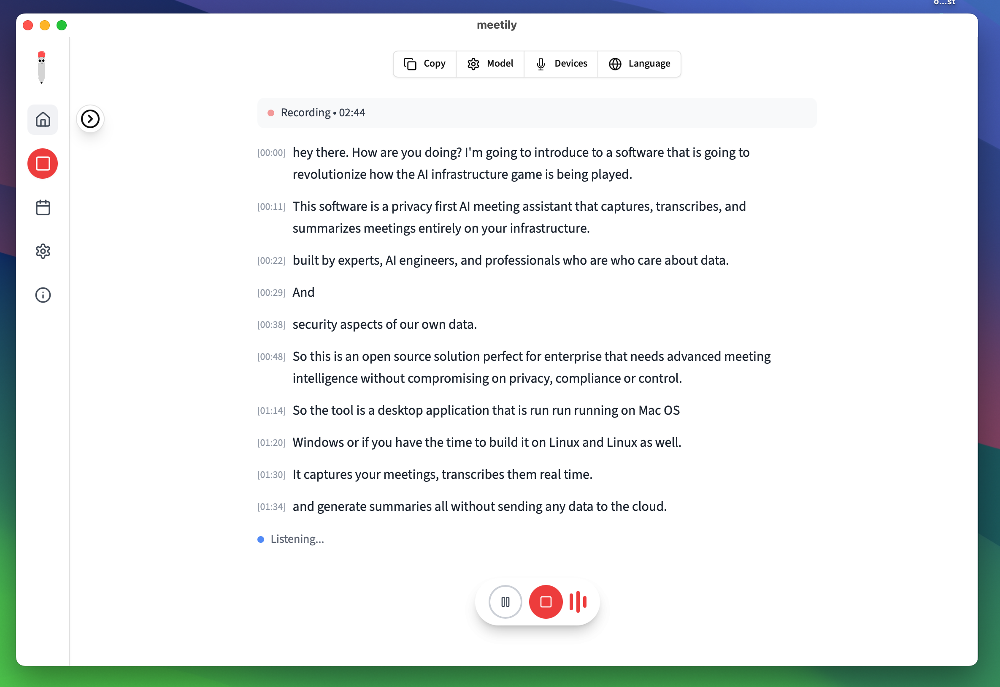
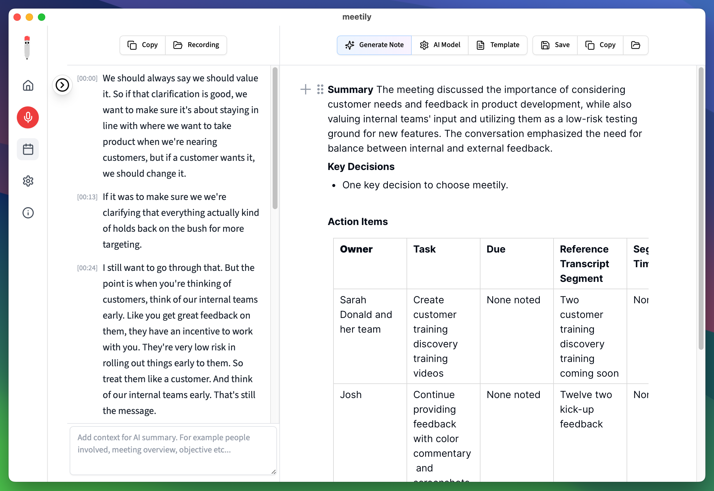
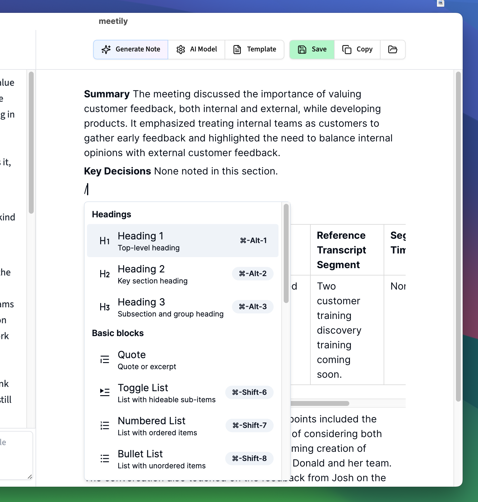
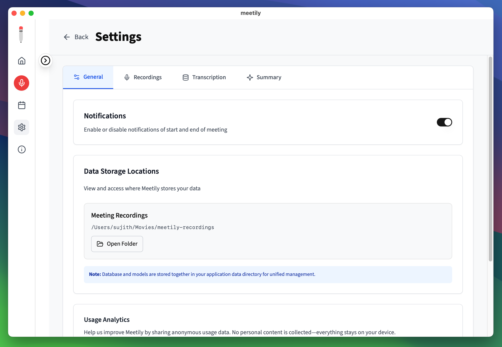
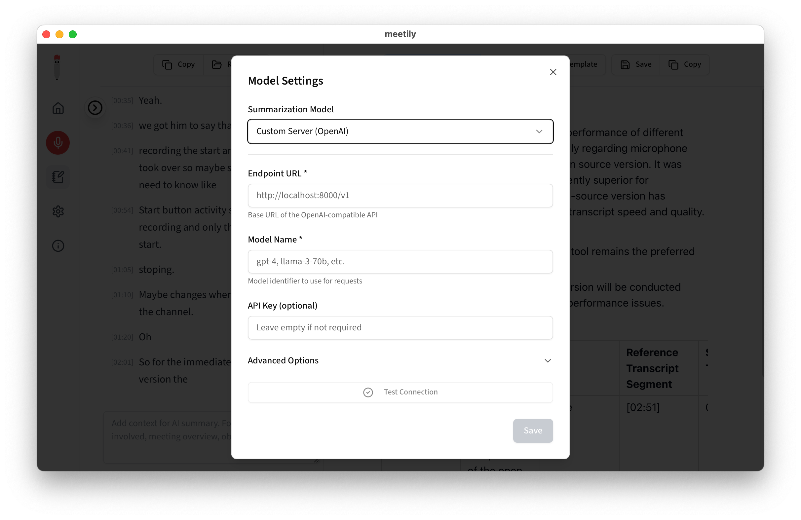
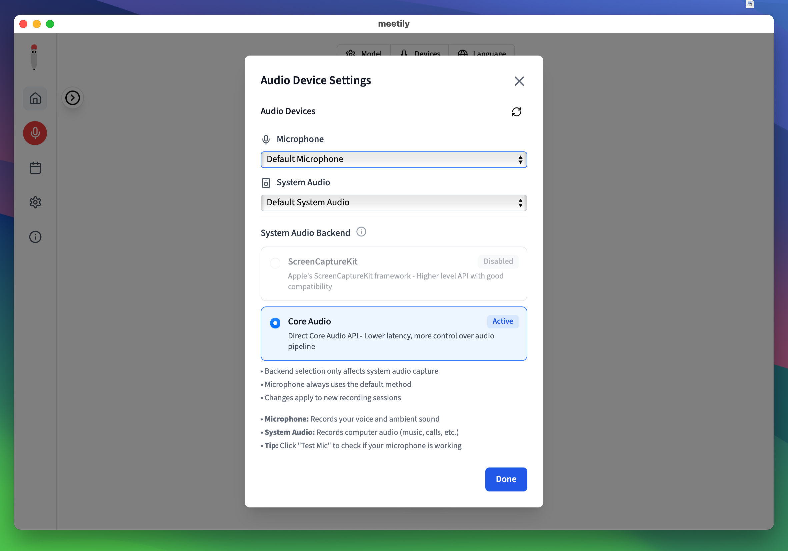
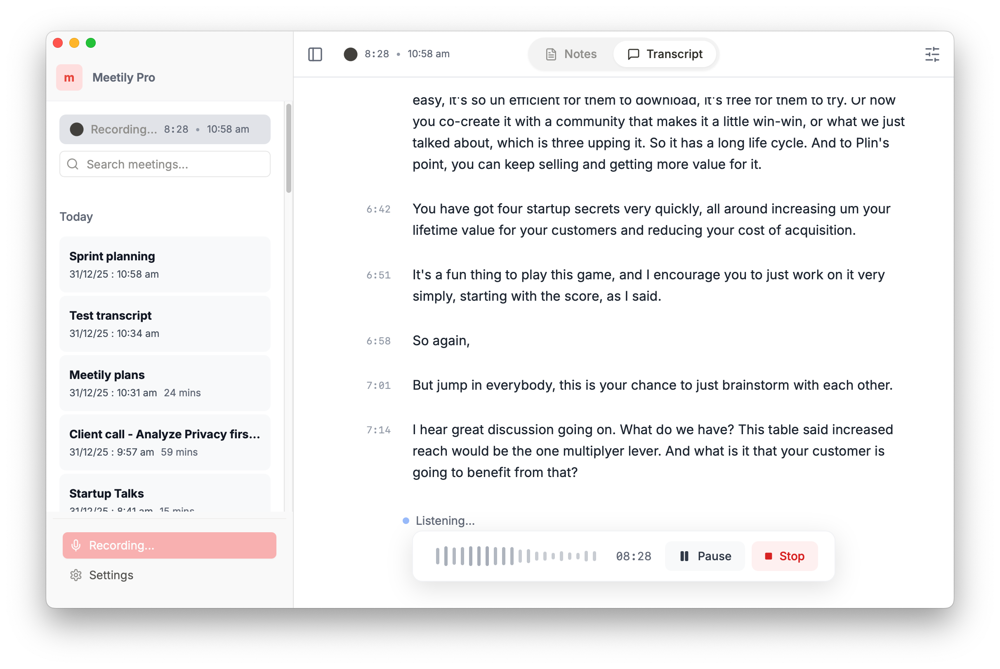

<div align="center" style="border-bottom: none">
    <h1>
        Siplinx AI
    </h1>
    <br>
    <a href="#"></a>
    <a href="#"></a>
    <a href="#"></a>
    <a href="#"></a>
    <br>
    <h3>
    <br>
    Privacy-First • Enterprise-Ready
    </h3>

<p align="center">

A privacy-first AI meeting assistant that captures, transcribes, and summarizes meetings entirely on your infrastructure. Built by expert AI engineers passionate about data sovereignty. Perfect for enterprises that need advanced meeting intelligence without compromising on privacy, compliance, or control.

</p>

<p align="center">
    
    <br>
    <a href="https://youtu.be/6FnhSC_eSz8">View full Demo Video</a>
</p>

</div>

---

> **🎉 New: Siplinx AI PRO Available** - Looking for enhanced accuracy and advanced features? Check out our professional-grade solution with custom summary templates, advanced exports (PDF, DOCX), auto-meeting detection, built-in GDPR compliance, and many more.

---

<details>
<summary>Table of Contents</summary>

- [Introduction](#introduction)
- [Why Siplinx AI?](#why-siplinx-ai)
- [Features](#features)
- [Installation](#installation)
- [Key Features in Action](#key-features-in-action)
- [System Architecture](#system-architecture)
- [For Developers](#for-developers)
- [Siplinx AI PRO](#siplinx-ai-pro)
- [Contributing](#contributing)
- [License](#license)

</details>

## Introduction

Siplinx AI is a privacy-first AI meeting assistant that runs entirely on your local machine. It captures your meetings, transcribes them in real-time, and generates summaries, all without sending any data to the cloud. This makes it the perfect solution for professionals and enterprises who need to maintain complete control over their sensitive information.

## Why Siplinx AI?

While there are many meeting transcription tools available, this solution stands out by offering:

- **Privacy First:** All processing happens locally on your device.
- **Cost-Effective:** Uses local AI models instead of expensive APIs.
- **Flexible:** Works offline and supports multiple meeting platforms.
- **Customizable:** Self-host and modify for your specific needs.

<details>
<summary>The Privacy Problem</summary>

Meeting AI tools create significant privacy and compliance risks across all sectors:

- **$4.4M average cost per data breach** (IBM 2024)
- **€5.88 billion in GDPR fines** issued by 2025
- **400+ unlawful recording cases** filed in California this year

Whether you're a defense consultant, enterprise executive, legal professional, or healthcare provider, your sensitive discussions shouldn't live on servers you don't control. Cloud meeting tools promise convenience but deliver privacy nightmares with unclear data storage practices and potential unauthorized access.

**Siplinx AI solves this:** Complete data sovereignty on your infrastructure, zero vendor lock-in, and full control over your sensitive conversations.

</details>

## Features

- **Local First:** All processing is done on your machine. No data ever leaves your computer.
- **Real-time Transcription:** Get a live transcript of your meeting as it happens.
- **AI-Powered Summaries:** Generate summaries of your meetings using powerful language models.
- **Multi-Platform:** Works on macOS, Windows, and Linux.
- **Free to Use:** No subscriptions or hidden fees for the core product.
- **Flexible AI Provider Support:** Choose from Ollama (local), Claude, Groq, OpenRouter, or use your own OpenAI-compatible endpoint.

## Installation

### 🪟 **Windows**

1. Download the latest `x64-setup.exe` from [Releases](../../releases/latest)
2. Run the installer

### 🍎 **macOS**

1. Download the `.dmg` file from [Releases](../../releases/latest)
2. Open the downloaded `.dmg` file
3. Drag the app to your Applications folder
4. Open the app from Applications folder

### 🐧 **Linux**

Build from source following our detailed guides:

- [Building on Linux](docs/building_in_linux.md)
- [General Build Instructions](docs/BUILDING.md)

**Quick start:**

```bash
git clone <this-repo>
cd meeting-minutes/frontend
pnpm install
./build-gpu.sh
```

## Key Features in Action

### 🎯 Local Transcription

Transcribe meetings entirely on your device using **Whisper** or **Parakeet** models. No cloud required.

<p align="center">
    
</p>

### 📥 Import & Enhance `Beta`

Import existing audio files to generate transcripts, or enhance to re-transcribe any recorded meeting with a different model or language, all processed locally.

<p align="center">
    
</p>

### 🤖 AI-Powered Summaries

Generate meeting summaries with your choice of AI provider. **Ollama** (local) is recommended, with support for Claude, Groq, OpenRouter, and OpenAI.

<p align="center">
    
</p>

<p align="center">
    
</p>

### 🔒 Privacy-First Design

All data stays on your machine. Transcription models, recordings, and transcripts are stored locally.

<p align="center">
    
</p>

### 🌐 Custom OpenAI Endpoint Support

Use your own OpenAI-compatible endpoint for AI summaries. Perfect for organizations with custom AI infrastructure or preferred providers.

<p align="center">
    
</p>

### 🎙️ Professional Audio Mixing

Capture microphone and system audio simultaneously with intelligent ducking and clipping prevention.

<p align="center">
    
</p>

### ⚡ GPU Acceleration

Built-in support for hardware acceleration across platforms:

- **macOS**: Apple Silicon (Metal) + CoreML
- **Windows/Linux**: NVIDIA (CUDA), AMD/Intel (Vulkan)

Automatically enabled at build time - no configuration needed.

## System Architecture

**Siplinx AI** is a single, self-contained application built with [Tauri](https://tauri.app/). It uses a Rust-based backend to handle all the core logic, and a Next.js frontend for the user interface.

For more details, see the [Architecture documentation](docs/architecture.md).

## For Developers

If you want to contribute or build from source, you'll need to have Rust and Node.js installed. For detailed build instructions, please see the [Building from Source guide](docs/BUILDING.md).

## Siplinx AI PRO

<p align="center">
    
</p>

**Siplinx AI PRO** is a professional-grade solution with enhanced accuracy and advanced features for serious users and teams. Built on a different codebase with superior transcription models and enterprise-ready capabilities.

### Key Advantages Over Community Edition:

- **Enhanced Accuracy**: Superior transcription models for professional-grade accuracy
- **Custom Summary Templates**: Tailor summaries to your specific workflow and needs
- **Advanced Export Options**: PDF, DOCX, and Markdown exports with formatting
- **Auto-detect and Join Meetings**: Automatic meeting detection and joining
- **Speaker Identification**: Distinguish between speakers automatically *(Coming Soon)*
- **Chat with Meetings**: AI-powered meeting insights and queries *(Coming Soon)*
- **Calendar Integration**: Seamless integration with your calendar *(Coming Soon)*
- **Self-Hosted Deployment**: Deploy on your own infrastructure for teams
- **GDPR Compliance Built-In**: Privacy by design architecture with complete audit trails
- **Priority Support**: Dedicated support for PRO users

### Who is Siplinx AI PRO for?

- **Professionals** who need the highest accuracy for critical meetings
- **Teams and organizations** (2-100 users) requiring self-hosted deployment
- **Power users** who need advanced export formats and custom workflows
- **Compliance-focused organizations** requiring GDPR readiness

> **Note:** Siplinx AI Community Edition remains **free forever** with local transcription, AI summaries, and core features. PRO is a separate professional solution for users who need enhanced accuracy and advanced capabilities.

## Contributing

We welcome contributions from the community! If you have any questions or suggestions, please open an issue or submit a pull request. Please follow the established project structure and guidelines. For more details, refer to the [CONTRIBUTING.md](CONTRIBUTING.md) file.

## License

MIT License - Feel free to use this project for your own purposes.

## Acknowledgments

- We borrowed some code from [Whisper.cpp](https://github.com/ggerganov/whisper.cpp).
- We borrowed some code from [Screenpipe](https://github.com/mediar-ai/screenpipe).
- We borrowed some code from [transcribe-rs](https://crates.io/crates/transcribe-rs).
- Thanks to **NVIDIA** for developing the **Parakeet** model.
- Thanks to [istupakov](https://huggingface.co/istupakov/parakeet-tdt-0.6b-v3-onnx) for providing the **ONNX conversion** of the Parakeet model.
